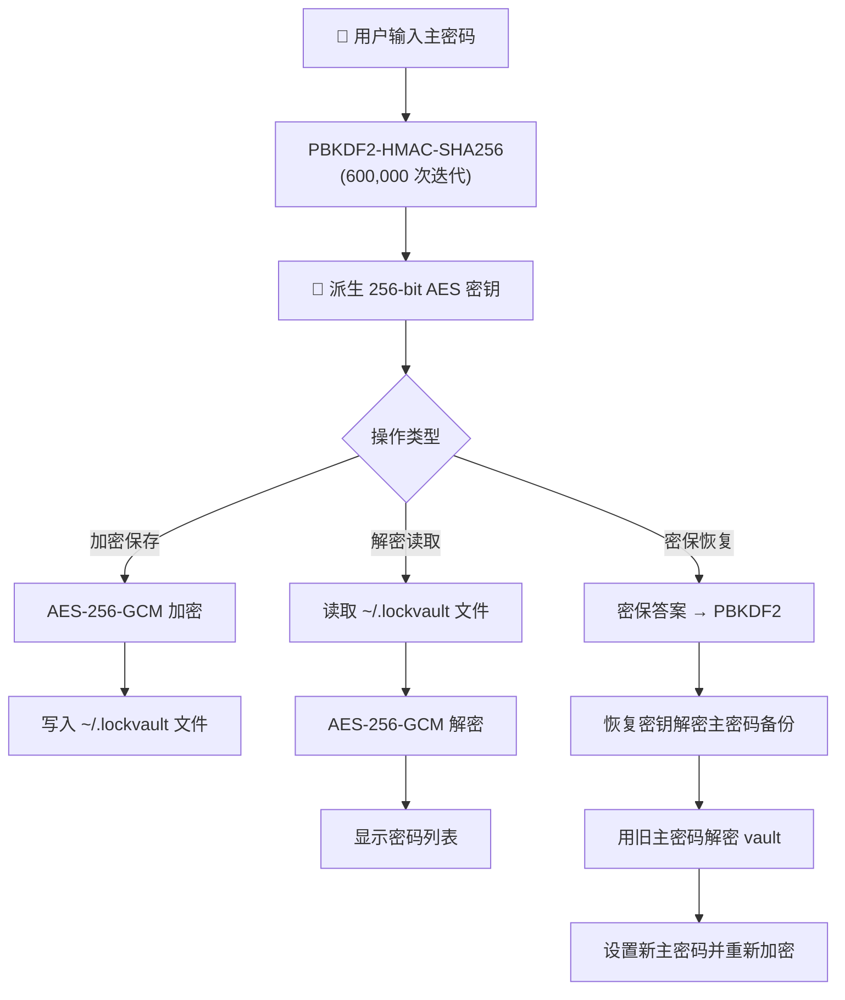
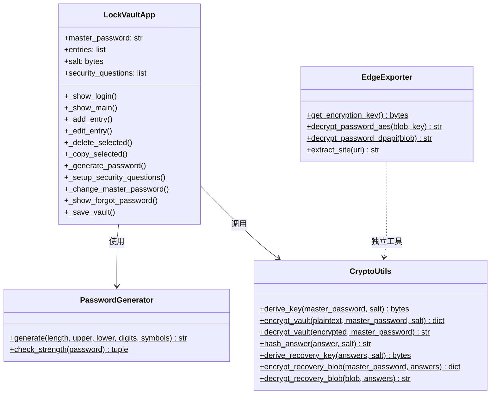
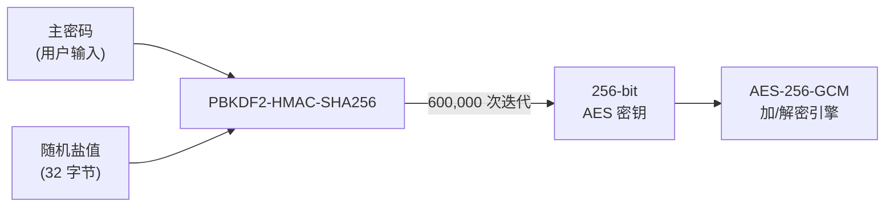
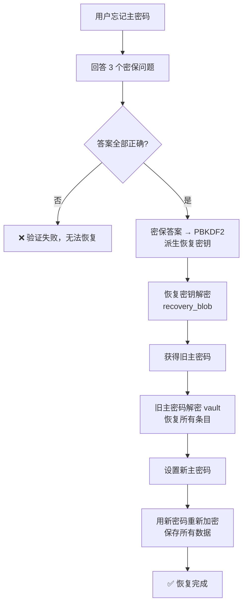
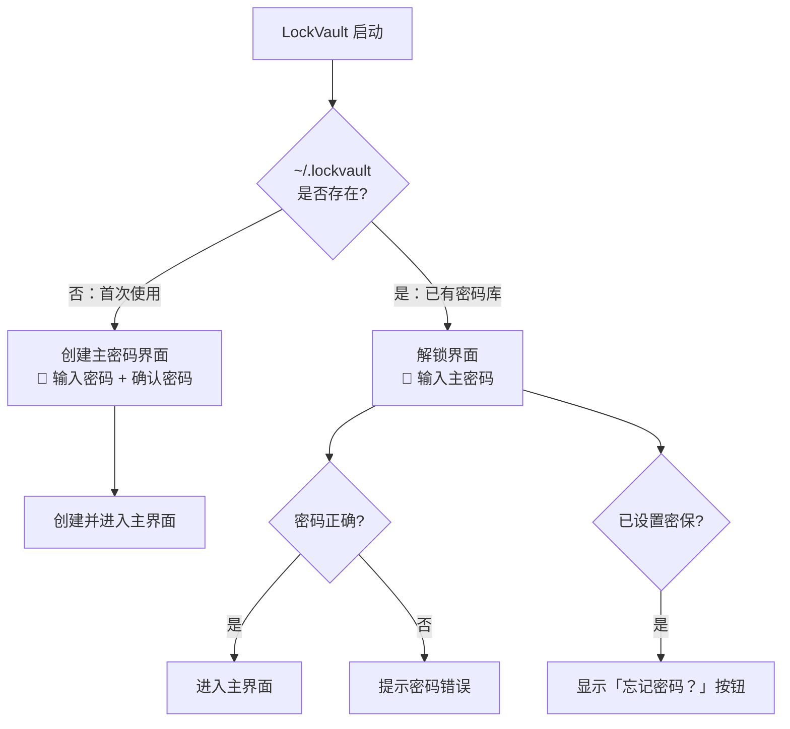
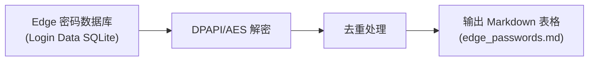

# LockVault 密码管理器 — 使用说明文档

> **版本：** 1.0  |  **最后更新：** 2026-05-28
> **技术栈：** Python 3 + Tkinter + AES-256-GCM

---

## 目录

- [项目概览](#项目概览)
- [设计思路](#设计思路)
- [系统架构](#系统架构)
- [加密机制详解](#加密机制详解)
- [功能模块](#功能模块)
- [界面说明](#界面说明)
- [使用指南](#使用指南)
- [工具与辅助脚本](#工具与辅助脚本)
- [构建与部署](#构建与部署)
- [常见问题](#常见问题)
- [安全建议](#安全建议)

---

## 项目概览

**LockVault** 是一款轻量级本地密码管理器，采用 **AES-256-GCM** 加密算法保护您的密码数据，所有数据均存储在本地，不依赖任何云服务。

### 核心特性

- **军事级加密** — AES-256-GCM + PBKDF2 密钥派生（60万次迭代）
- **零云端依赖** — 所有数据仅存于本地 `~/.lockvault` 文件
- **密保恢复** — 通过安全问题找回忘记的主密码
- **密码生成器** — 可配置的高强度随机密码生成
- **剪贴板保护** — 复制密码后 15 秒自动清除
- **Edge 导入** — 一键导入 Edge 浏览器中保存的密码

### 项目结构

```
密码管理器/
├── password_manager/
│   ├── password_manager.py    # 主程序（1458 行）
│   ├── requirements.txt       # Python 依赖
│   └── build.bat             # 打包脚本
├── export_edge_passwords.py   # Edge 密码导出工具
├── edge_passwords.md          # 导出示例输出
├── PasswordManager.spec       # PyInstaller 配置
├── dist/
│   └── PasswordManager.exe    # 打包后的可执行文件
└── README.md                  # 本文档
```

---

## 设计思路

### 1. 安全第一的设计哲学

LockVault 的核心理念是 **"安全不妥协"**。在设计上遵循以下原则：

```
┌─────────────────────────────────────────────────────┐
│                  安全设计金字塔                        │
├─────────────────────────────────────────────────────┤
│                                                     │
│                    🔒 数据安全                        │
│               AES-256-GCM 加密存储                    │
│                                                     │
│              🔑 密钥安全（PBKDF2）                    │
│           600,000 次迭代防暴力破解                      │
│                                                     │
│           🛡️ 访问安全（主密码 + 密保）                 │
│          双重身份验证 + 密码恢复机制                     │
│                                                     │
│          🧹 运行时安全（剪贴板自清理）                   │
│         15秒后自动清除敏感数据                          │
│                                                     │
└─────────────────────────────────────────────────────┘
```

### 2. 本地优先，零信任云

所有密码数据存储在用户目录下的 `~/.lockvault` 文件中，**永远不会**通过网络传输。这意味着：

- 即使电脑被入侵，攻击者拿到的也只是加密后的密文
- 不需要注册账号，不需要联网
- 数据完全由用户掌控

### 3. 简洁而不简单

界面采用 Tkinter 原生控件，追求**功能完整**而非视觉花哨：

- 所有操作在主窗口 + 弹窗中完成，学习成本极低
- 支持右键菜单、双击复制、搜索过滤等快捷操作
- 底部状态栏实时反馈操作结果

---

## 系统架构

### 整体数据流



### 模块关系



---

## 加密机制详解

### 密钥派生流程



### 加密存储格式

每个 vault 文件是一个 JSON 结构：

```json
{
  "salt": "64位十六进制字符串（32字节随机盐）",
  "nonce": "24位十六进制字符串（12字节随机数）",
  "data": "AES-256-GCM 加密后的密文（十六进制）",
  "security": {
    "questions": [
      {
        "q": "密保问题文本",
        "a_hash": "SHA-256(答案+盐) 的十六进制哈希",
        "a_salt": "答案盐值的十六进制"
      }
    ],
    "recovery": {
      "recovery_salt": "恢复密钥盐值",
      "recovery_nonce": "恢复密钥随机数",
      "recovery_blob": "用密保答案加密的主密码备份"
    }
  }
}
```

### 密码恢复机制



---

## 功能模块

### 模块总览

| 模块 | 功能 | 安全特性 |
|------|------|----------|
| **登录系统** | 创建/验证主密码 | PBKDF2 密钥派生 |
| **密码存储** | 添加/编辑/删除条目 | AES-256-GCM 加密 |
| **密码生成** | 可配置随机密码 | 密码强度评估 |
| **剪贴板管理** | 一键复制密码 | 15秒自动清除 |
| **搜索过滤** | 实时搜索条目 | 仅匹配本地数据 |
| **密保系统** | 设置/验证安全问题 | SHA-256 哈希存储 |
| **密码恢复** | 通过密保重置密码 | 恢复密钥加密 |
| **Edge 导入** | 导出浏览器保存密码 | AES-256-GCM 解密 |

---

## 界面说明

### 登录界面

启动应用后，首先看到登录界面：



> 💡 **首次使用提示**：请牢记您的主密码！丢失后无法恢复数据。建议使用 8 位以上，包含大小写字母和数字。

### 主界面布局

```
┌──────────────────────────────────────────────────────────────┐
│  🔒 LockVault                                                │
├──────────────────────────────────────────────────────────────┤
│ ➕ 添加  🔑 生成密码  📋 复制密码  🗑 删除 │ 🔒 修改主密码  🔐 设置密保 │ 搜索：[________]  共 N 条 │
├──────────────────────────────────────────────────────────────┤
│ ┌──────────────┬──────────────┬──────────────────────────┐   │
│ │ 网站 / 应用   │ 用户名        │ 备注                      │   │
│ ├──────────────┼──────────────┼──────────────────────────┤   │
│ │ github.com   │ user123      │ 个人代码仓库               │   │
│ │ taobao.com   │ shop888      │ 淘宝账号                   │   │
│ │ gmail.com    │ me@gmail     │ 工作邮箱                   │   │
│ │              │              │                          │   │
│ └──────────────┴──────────────┴──────────────────────────┘   │
├──────────────────────────────────────────────────────────────┤
│ ✅ 密码已复制到剪贴板（15秒后自动清除） — 「github.com」         │
└──────────────────────────────────────────────────────────────┘
```

### 界面交互说明

| 操作 | 方法 | 说明 |
|------|------|------|
| **添加密码** | 点击「➕ 添加」按钮 | 弹出添加对话框，填写网站、用户名、密码、备注 |
| **编辑密码** | 右键 → 编辑 | 修改已有条目的信息 |
| **复制密码** | 双击条目 / 选中后点「📋 复制密码」/ 右键 → 复制密码 | 密码自动复制到剪贴板，15秒后清除 |
| **复制用户名** | 右键 → 复制用户名 | 复制选中条目的用户名 |
| **删除密码** | 选中条目 → 点「🗑 删除」/ 右键 → 删除 | 二次确认后删除 |
| **搜索** | 在搜索框输入关键词 | 实时过滤匹配的条目（匹配网站名、用户名、备注） |
| **生成密码** | 点击「🔑 生成密码」按钮 | 打开密码生成器，可配置长度和字符类型 |

---

## 使用指南

### 第一步：首次设置

1. **启动应用** — 双击 `PasswordManager.exe` 或运行 `python password_manager.py`
2. **创建主密码** — 输入一个强密码（至少8位，建议包含大小写字母、数字和符号）
3. **确认密码** — 再次输入相同的密码
4. **点击「创建并进入」** — 密码库创建完成

> ⚠️ **重要**：主密码丢失后**无法恢复**！请务必牢记或安全保存。

### 第二步：设置密保问题（强烈建议）

1. 进入主界面后，点击顶部工具栏的 **「🔐 设置密保」**
2. 回答 3 个安全问题（建议选择只有你知道答案的问题）
3. 点击 **「保存」**

密保问题用于在忘记主密码时恢复访问。密保答案以 SHA-256 哈希存储，不会以明文保存。

### 第三步：添加密码

1. 点击 **「➕ 添加」** 按钮
2. 填写信息：
   - **网站/应用**（必填）：如 `github.com`
   - **用户名**：如 `my_username`
   - **密码**（必填）：可以手动输入，也可以点击「🎲 生成随机密码」自动生成
   - **备注**：可选的说明信息
3. 点击 **「保存」**

### 第四步：使用密码

- **复制密码**：双击列表中的条目，或选中后点击「📋 复制密码」
- **复制用户名**：右键条目 → 选择「📋 复制用户名」
- **搜索条目**：在搜索框输入关键词，列表实时过滤

> 🔒 复制到剪贴板的密码会在 **15 秒后自动清除**，防止意外泄露。

### 第五步：管理密码

- **编辑**：右键条目 → 「✏ 编辑」
- **删除**：选中条目 → 点击「🗑 删除」或右键 → 「🗑 删除」
- **修改主密码**：点击「🔒 修改主密码」，需先验证当前密码

### 第六步：忘记密码恢复

1. 在登录界面点击 **「忘记密码？」**
2. 回答 3 个密保问题
3. 验证通过后，设置新的主密码
4. 所有密码数据将被保留并用新密码重新加密

---

## 工具与辅助脚本

### Edge 浏览器密码导出工具

`export_edge_passwords.py` 可以将 Microsoft Edge 浏览器中保存的密码导出为 Markdown 表格。



**使用方法：**

```bash
# 安装依赖
pip install pywin32 cryptography

# 运行导出
python export_edge_passwords.py
```

**输出示例：**

| 网站 / 应用 | 用户名 | 密码 | 备注（原始URL） |
| --- | --- | --- | --- |
| account.teamviewer.com |  | Why010411.. | https://account.teamviewer.com/... |
| leetcode.cn |  | WHY010411.. | https://leetcode.cn/... |

> ⚠️ 导出的 Markdown 文件包含明文密码，请妥善保管或使用后删除。

---

## 构建与部署

### 从源码运行

```bash
# 安装依赖
pip install -r password_manager/requirements.txt

# 运行应用
python password_manager/password_manager.py
```

### 打包为 EXE

```bash
# 方式一：使用构建脚本（推荐）
cd password_manager
build.bat

# 方式二：手动构建
pip install pyinstaller
pyinstaller --onefile --windowed --name PasswordManager --clean --noconfirm password_manager/password_manager.py
```

构建完成后，可执行文件位于 `dist/PasswordManager.exe`。

### 依赖清单

| 依赖 | 版本要求 | 用途 |
|------|----------|------|
| `cryptography` | ≥ 41.0.0 | AES-256-GCM 加密、PBKDF2 密钥派生 |
| `pyperclip` | ≥ 1.8.0 | 剪贴板操作 |
| `pyinstaller` | ≥ 6.0.0 | 打包为独立 EXE（仅构建时需要） |

---

## 常见问题

### Q：忘记主密码怎么办？

**A：** 如果已设置密保问题，在登录界面点击「忘记密码？」即可通过密保重置。如果未设置密保，数据将无法恢复。

### Q：密码库文件在哪里？

**A：** 存储在 `~/.lockvault`（即 `C:\Users\你的用户名\.lockvault`）。这是一个加密的 JSON 文件。

### Q：能否把密码库文件复制到其他电脑使用？

**A：** 可以。将 `.lockvault` 文件复制到新电脑的用户目录下，用同样的主密码即可解锁。

### Q：剪贴板清除功能不工作？

**A：** 需要安装 `pyperclip` 库（`pip install pyperclip`）。如果未安装，应用仍可正常使用，但剪贴板自动清除功能不可用。

### Q：支持哪些操作系统？

**A：** 当前版本支持 **Windows**（包括 EXE 打包）。理论上支持 macOS 和 Linux（需安装 `tkinter`），但 Edge 导出工具仅支持 Windows。

### Q：密码强度是如何评估的？

**A：** 基于以下维度综合评分：
- 密码长度（≥12 位加分，≥16 位再加分）
- 包含小写字母
- 包含大写字母
- 包含数字
- 包含特殊符号

评分结果：**弱**（≤2分）、**中**（3-4分）、**强**（≥5分）。

---

## 安全建议

1. **使用强主密码** — 至少 12 位，混合大小写字母、数字和符号
2. **务必设置密保问题** — 这是忘记密码后唯一的恢复途径
3. **定期备份 `.lockvault` 文件** — 加密后的备份可安全存储在 U 盘或云端
4. **不要在公共电脑上使用** — 使用后确保删除密码库文件
5. **使用内置密码生成器** — 避免重复使用相同密码
6. **注意导出文件安全** — Edge 导出的 Markdown 包含明文密码，使用后及时删除

---

> 📝 **关于 LockVault**
> LockVault 是一款注重安全性的本地密码管理器。所有加密均采用业界标准算法，数据完全离线存储。
> 如有问题或建议，欢迎反馈。
